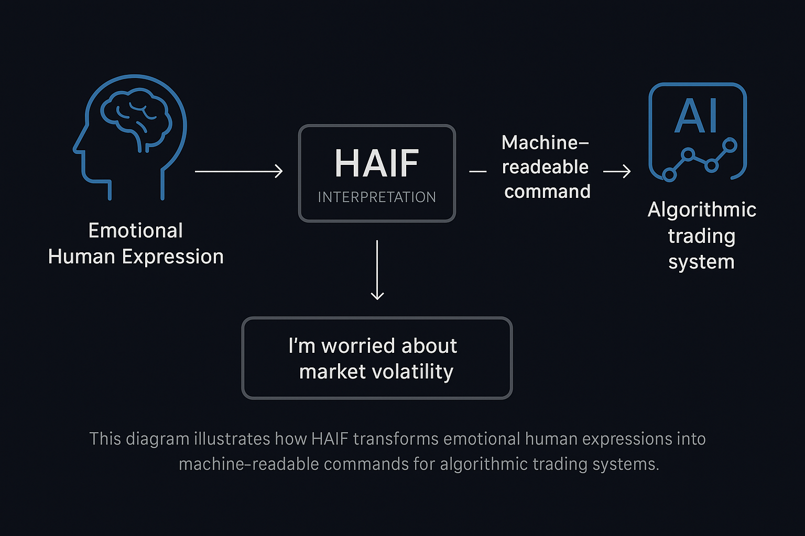

# 🧠💬 HAIF – Human-AI Interpreter Framework

## 0. Introduction

In the fast-paced world of algorithmic trading, communication between human intent and AI execution often breaks down—especially when emotional, nuanced, or ambiguous language is involved. **HAIF (Human-AI Interpreter Framework)** is designed to bridge that gap.

HAIF specializes in **translating emotionally rich or informal human language into precise, machine-readable logic**, enabling smoother and safer collaboration between traders, analysts, and AI systems. Whether it’s interpreting “I’m worried about market volatility” into risk-adjusted trade parameters, or rephrasing vague preferences like “play it safe today,” HAIF helps transform human judgment into structured input for automated systems.

## 1. Features

- **Emotional Language Parsing**: Understands colloquial, emotional, and context-rich language commonly used by human traders.
- **AI-Compatible Translation**: Converts human expressions into formats suitable for algorithmic interpretation and execution.
- **Trading-Aware Vocabulary**: Trained with financial language to maintain accuracy in domain-specific contexts.
- **Interpretability Layer**: Provides transparent, traceable mappings between human inputs and AI actions to support trust and auditability.
- **Role-Adaptive Profiles**: Adapts its interpretation style based on the user (e.g., analyst, portfolio manager, risk officer).

## 2. Use Cases

- **Trader-AI Communication**: Translate high-level directives like “keep it conservative” or “look for momentum” into precise trading signals.
- **Emotion-Aware Trading Bots**: Enhance bots with the ability to interpret behavioral cues or psychological states.
- **Cross-Team Collaboration**: Help bridge language between departments (e.g., strategy vs. execution) by standardizing inputs.
- **Education & Onboarding**: Assist new traders in understanding how natural language translates to trading strategies and rules.

## 3. Visual Overview

  

> This diagram illustrates how HAIF transforms emotional human expressions into machine-readable commands for algorithmic trading systems.

## 4. Contributing

We welcome collaborators from the fields of natural language processing, finance, human-computer interaction, and cognitive science. Please open an issue or pull request to contribute ideas or improvements.

## 5. License

This project is licensed under the MIT License. See the [LICENSE](LICENSE) file for details.

## 6. References

HAIF is grounded in multidisciplinary research across **natural language understanding**, **human-computer collaboration**, and **emotion-aware AI systems**, particularly in financial and decision-support contexts. Foundational references include:

### 🧠 Human-AI Interaction & Interpretation

- Shneiderman, B. (2020). *Human-Centered Artificial Intelligence: Reliable, Safe & Trustworthy*.  
  https://doi.org/10.1080/10447318.2020.1741118

- Amershi, S., et al. (2019). *Guidelines for Human-AI Interaction*.  
  https://doi.org/10.1145/3290605.3300233

- Luger, E., & Sellen, A. (2016). *“Like Having a Really Bad PA”: The Gulf between User Expectation and Experience of Conversational Agents*.  
  https://doi.org/10.1145/2858036.2858288

- Seaborn, K., & Fels, D. I. (2015). *Human-Centered AI and the Implications for Design*.  
  https://doi.org/10.1093/iwc/iwu030

### 💬 Language, Emotion & Computation

- Calefato, F., et al. (2018). *Sentiment Analysis for Software Engineering*.  
  https://doi.org/10.1145/3183519.3183540

- Choi, E., et al. (2020). *Detecting Linguistic Characteristics of Emotion-Aware Language in Human-AI Dialogues*.  
  https://doi.org/10.18653/v1/2020.emnlp-main.621

- Liu, P., et al. (2023). *How Do Users Express and AI Understand Emotion in Professional Tasks?*  
  https://doi.org/10.1145/3544548.3581500

- Binns, R., et al. (2018). *‘It’s Reducing a Human Being to a Percentage’*.  
  https://doi.org/10.1145/3173574.3173951

### 📈 AI in Financial Decision Support

- Lopez de Prado, M. (2018). *Advances in Financial Machine Learning*.  
  ISBN: 978-1119482086

- Das, S. R. (2014). *Text and Context: Language Analytics in Finance*.  
  https://doi.org/10.1561/0500000031

- Nielsen, M. A. (2019). *Neural Networks and Deep Learning*.  
  http://neuralnetworksanddeeplearning.com/

---

**HAIF – Bridging the gap between how humans feel and how AIs compute.**